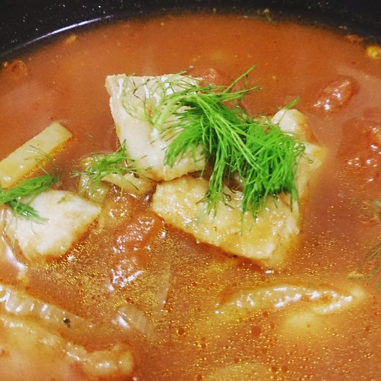

Title: Tuscan Inspired Fish and Fennel Soup
Date: 2016-03-16
Category: Food
Tags: soup, fish, dinner

A wonderful soup for autumn, when you want something light but warming. Add some crusty bread for mopping up the remains of soup, and you have a meal!

**Difficulty:** Easy

**Time:** 30 mins

**Ingredients:**

* 2 fennel bulbs

* 2 Tbsp paprika

* 1 bay leaf

* 2 400g cans of tinned tomatoes (I prefer crushed, but whatever floats your boat)

* 4L fish stock (vegetable stock will work too, in a pinch)

* 750g white fish

* Salt and pepper, to taste

**Method:**

1. Slice two fennel bulbs and gently fry until becoming translucent.

2. Add 2 Tbsp paprika and a bay leaf and stir

3. Add 2 cans tinned tomatoes, 4L fish stock, salt and pepper

4. Simmer for ~20min

5. Chop 750g white fish (I used cod) into ~1inch chunks and add.

6. Cook for 3min

7. Take off heat, add salt and pepper to taste

8. Serve with fennel fronds

